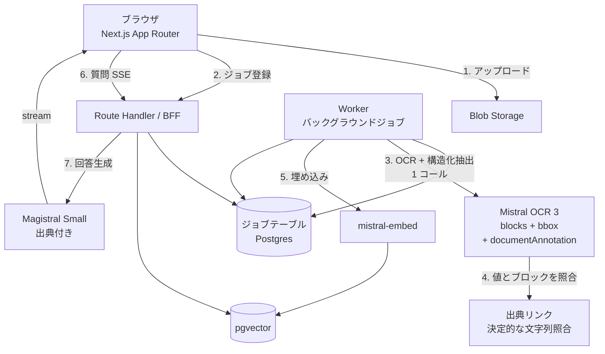

# Mistral AI を使った Web アプリ 企画・実装プラン

作成日: 2026-08-14

---

## 0. このドキュメントの結論（先に要点）

**作るもの: `DocLens` — PDF / 画像の書類を投げると、①構造化データ（JSON / 表）と ②出典ハイライト付きの Q&A が返る Document Intelligence Web アプリ。**

理由を一行で言うと、**Mistral の相対的な強みが「汎用チャット」ではなく「書類を安く大量に読む」ことに寄っているから**です。汎用チャットボットを作ると他社モデルとの差が出ませんが、OCR + 構造化抽出 + 安価な小型モデルの組み合わせは Mistral が明確に競争力を持つ領域で、しかも「業務で実際に使える」出口があります。

MVP 想定工数: **実働 5〜7 日（週末 3 回分くらい）**。

---

## 実装状況（2026-08-14 更新）

Phase 1〜2 に相当する部分を [`doclens/`](../doclens/) に実装済みです。アップロード →
OCR + 構造化抽出 → 表表示 → **クリックで PDF の該当箇所をハイライト**まで通っています。

実装の過程で、当初の想定より良い方向に変わった点が 2 つあります。

1. **bbox は確実に取れる。** 本プランの最大リスクとして挙げていた点ですが、OCR API は
   `pages[].blocks[]` として段落単位の矩形（`top_left_x` 等の絶対ピクセル）とテキストを
   返すことが SDK の型定義から確認できました。ページの `dimensions` で正規化すれば、
   ビューア側は DPI を知らずに済みます。**Phase 0 の「座標系を特定する」作業は不要になりました。**
2. **OCR と構造化抽出は 1 コールで済む。** `document_annotation_format` に JSON Schema を
   渡すと、ページ内容と一緒に構造化フィールドが返ります。OCR → 抽出用 LLM の 2 段構成が
   不要になり、コストも往復回数も減りました。

一方、**日本語 OCR の精度は依然として未検証**です。これは実物の書類がないと測れないため、
Phase 0 のスパイクスクリプト（`npm run spike:ocr`）を用意してあります。

---

## 1. なぜ Mistral なのか（アプリ案の選定基準）

アプリ案を出す前に、「Mistral でやると嬉しいこと / 嬉しくないこと」を整理しました。ここが案の良し悪しをほぼ決めます。

### Mistral の効きどころ

| 強み | 中身 | アプリ設計への意味 |
|---|---|---|
| **Document AI (OCR 3)** | 構造化アノテーション、バウンディングボックス、ドキュメント Q&A に対応。おおむね **$2 / 1,000 ページ**（アノテーション付きで $3 / 1,000 ページ）水準 | 「1 ページあたり 0.3 円程度」で書類が読める。**大量処理を前提にした UX** が組める |
| **小型モデルが極端に安い** | Ministral 3 系（3B / 8B / 14B）、Mistral Small 系。Nemo は $0.02 / M トークン水準 | 分類・タグ付け・抽出のような**単純タスクを富豪的に回せる**。1 リクエスト内で何十回も LLM を呼ぶ設計が現実的 |
| **推論モデルも安い** | Magistral Small ($0.50 / $1.50)、Magistral Medium ($2.00 / $5.00) per M tokens | 「複雑な照合・突合」だけ推論モデルに回すハイブリッド構成が組める |
| **オープンウェイト** | Mistral Small / Ministral / Devstral などは自前ホスト可 | 「まず API、伸びたら自前ホストへ」の**出口がある**。オンプレ要件のある顧客に刺さる |
| **多言語 / 欧州データ主権** | 欧州系言語に強く、EU リージョン運用の文脈で採用されやすい | 日本語も実用水準。ただし後述の通り**日本語 OCR は要検証** |
| **Codestral (FIM)** | `/v1/fim/completions` で prefix + suffix を与えたコード補完 | Web アプリより **IDE 拡張向き**。今回は主軸から外す |

### 効きどころではない場所

- **汎用チャットボット** — 差別化ゼロ。「Mistral を使う理由」が価格しか残らない。
- **最高難度の推論 / エージェント** — フロンティアモデル勢と正面から比べる土俵に乗る必要がない。
- **画像生成・音声** — Mistral の主戦場ではない。

> **選定基準**: 「OCR / 構造化抽出 / 大量の安価な推論」のどれかを軸に据える。

---

## 2. アプリ案 3 つと比較

| | **案 A: DocLens**（推奨） | 案 B: 社内ドキュメント RAG | 案 C: 多言語ミーティング要約 |
|---|---|---|---|
| **概要** | 書類 → 構造化 JSON + 出典付き Q&A | 社内 Wiki / PDF を検索して回答 | 議事録を多言語で要約・アクション抽出 |
| **Mistral 適合度** | ◎ OCR 3 が主役 | △ 埋め込みと生成だけ。他社でも同じ | ○ 安い長文処理は効く |
| **差別化** | ◎ OCR + bbox ハイライトは体験として強い | ✕ 世に溢れている | △ 競合多数 |
| **実装難度** | 中（OCR の座標を UI に載せる部分が山場） | 低 | 中（音声入力が別途必要） |
| **実用性 / 出口** | ◎ 経費精算・請求書処理・契約レビューに直結 | ○ | ○ |
| **ランニングコスト** | ◎ ページ課金で読める | ○ | △ 長文は出力トークンが嵩む |

**採用: 案 A (DocLens)。** 案 B は「Mistral である必然性」が薄く、案 C は音声入力という別軸の課題を抱え込みます。案 A は Mistral の一番強いカードを主役に据えられます。

---

## 3. DocLens 仕様

### 3.1 ユースケース（MVP のターゲットを 1 つに絞る）

MVP は **「請求書・領収書の束を投げて、経費データの表にする」** に絞ります。汎用の「なんでも読む」は後回し。理由は、正解が明確で、精度評価がしやすく、価値が説明しやすいからです。

### 3.2 ユーザーストーリー

1. PDF / 画像（複数可、〜50 ページ）をドラッグ & ドロップする
2. 進捗バーが出て、数十秒で解析が終わる
3. 右ペインに **抽出結果の表**（発行日 / 取引先 / 品目 / 税抜 / 税額 / 合計 / 通貨）が出る
4. 表のセルをクリックすると、**左の PDF ビューアで該当箇所がハイライト**される ← ここが体験の核
5. 「この中で 10 万円を超える取引は？」のように自然文で質問できる。回答には出典（ページ + 座標）が付く
6. CSV / JSON でエクスポートする

### 3.3 画面構成

```
┌─────────────────────────────┬───────────────────────────┐
│  PDF Viewer                 │  [抽出結果] [チャット]     │
│  ┌───────────────────────┐  │  ┌─────────────────────┐  │
│  │                       │  │  │ 日付   取引先  合計 │  │
│  │   ▓▓▓▓ ← ハイライト    │  │  │ 08/01  A商事  ¥12k │  │← クリックで
│  │                       │  │  │ 08/03  B社    ¥98k │  │  左が飛ぶ
│  └───────────────────────┘  │  └─────────────────────┘  │
│  ◀ 1 / 12 ▶                 │  [CSV 出力]               │
└─────────────────────────────┴───────────────────────────┘
```

---

## 4. アーキテクチャ



**設計上の要点**

- **API キーはサーバのみ。** Route Handler を BFF にし、ブラウザから Mistral を直接叩かない。
- **OCR はバックグラウンドジョブ。** 50 ページの解析はサーバレス関数のタイムアウトに引っかかるので、同期処理にしない。MVP なら Vercel の場合 Queue / Cron、あるいは Supabase Edge Functions + ジョブテーブルで十分。
- **モデルを役割で使い分ける（これがコスト設計の肝）**
  - 書類 1 枚の抽出 → **OCR 3 の `document_annotation`**（OCR と同一コール。追加の LLM 呼び出し不要）
  - 横断的な質問・突合・計算 → **Magistral Small**（推論モデル、必要な時だけ）
  - 検索 → **mistral-embed** + pgvector
- **JSON スキーマは Zod から生成する。** Zod スキーマを唯一の定義元とし、API に渡す JSON Schema をそこから生成、レスポンス検証にも同じスキーマを使う。リクエストとレスポンスの型がずれることが原理的に起きない。
- **bbox を DB に残す。** OCR が返す座標を抽出フィールドごとに保存しておかないと、ハイライト機能が作れない。**ここを後付けにすると作り直しになるので初日から設計に入れる。**
- **出典の特定に LLM を使わない。** 抽出値と OCR ブロックの照合は決定的な文字列マッチで行う。追加コストがゼロで、出典を捏造せず、失敗時は「ハイライトが出ない」という目に見える形で失敗する（間違った箇所を指さない）。

---

## 5. 技術スタック

| レイヤ | 選定 | 備考 |
|---|---|---|
| フレームワーク | Next.js 15 (App Router) + TypeScript | Route Handler を BFF に |
| UI | Tailwind CSS + shadcn/ui | 表と分割ペインが安く作れる |
| PDF 表示 | `pdf.js` (react-pdf) | canvas 上に絶対配置で bbox オーバーレイ |
| LLM SDK | `@mistralai/mistralai` | OCR / chat / embeddings / FIM を一括で |
| DB | Postgres + pgvector (Supabase / Neon) | ジョブ・抽出結果・ベクトルを 1 箇所に |
| ストレージ | Supabase Storage or Vercel Blob | 署名付き URL で配信 |
| 認証 | Supabase Auth（Magic Link） | MVP は最小限 |
| バリデーション | Zod | LLM 出力の再検証に必須 |
| デプロイ | Vercel | |

---

## 6. 実装フェーズ

### Phase 0 — 検証スパイク（0.5 日）★ここを飛ばさない

**日本語の請求書・領収書 10 枚で OCR 3 の精度と bbox の座標系を確認する。**
CLI スクリプト 1 本で十分です。ここが実用に耐えないなら、以降の設計は全部無駄になります。

スパイクスクリプトは実装済みです（`npm run spike:ocr -- <file>`）。**残っているのは実物の書類を通すことだけ**で、これは手元に本物がないと測れません。

- [x] `@mistralai/mistralai` で OCR を叩くスクリプトを用意
- [x] bbox の座標系を特定 → `blocks[]` の絶対ピクセル。ページの `dimensions` で正規化する
- [ ] **日本語の請求書・領収書 10 枚で主要フィールドの精度を確認する**
- [ ] 手書き文字・レシートの感熱紙・傾いたスキャンで劣化具合を見る
- [ ] 1 ページあたりの実測レイテンシとコストを記録

**判断ポイント**: 印字された請求書で主要フィールドが取れるなら GO。手書きが壊滅的でも、MVP のターゲットは印字書類なので許容。

### Phase 1 — 縦に 1 本通す（2 日）✅

認証も UI の綺麗さも後回しで、**1 ファイル → OCR → 抽出 → 画面に表示**を最短で通します。

- [x] Next.js プロジェクト作成、環境変数に API キー
- [x] アップロード → ジョブ登録（MVP はインメモリ。制約は README に明記）
- [x] Worker: OCR + `document_annotation` で抽出 → bbox 込みで保持
- [x] 結果を表で表示

### Phase 2 — 体験の核を作る（1.5 日）✅

- [x] pdf.js ビューアを左ペインに設置
- [x] bbox オーバーレイ描画、表のセルクリック → 該当ページへ移動 + ハイライト
- [x] 複数ファイル / 複数ページ対応、進捗表示

### Phase 3 — Q&A（1.5 日）

- [ ] チャンク分割 → `mistral-embed` → pgvector に格納
- [ ] 質問 → ベクトル検索 → Magistral Small に投げて **SSE ストリーミング**で返す
- [ ] 回答中の出典参照をクリック可能にし、Phase 2 のハイライトに繋ぐ

### Phase 4 — 仕上げ（1 日）

- [x] CSV エクスポート（Excel が日本語を化けさせないよう BOM 付き）
- [x] ファイルサイズ・枚数・ページ数の上限、429 / 5xx の指数バックオフ
- [ ] 永続化（Postgres + キュー + オブジェクトストレージ）でインメモリを置き換える
- [ ] 認証、ユーザーごとのデータ分離（RLS）
- [ ] 30 枚程度の評価セットでフィールド単位の正解率を測る

---

## 7. コスト試算（月間 1,000 ページ処理の想定）

| 項目 | 単価（目安） | 月額 |
|---|---|---|
| OCR 3 + 構造化抽出（アノテーション付き） | $3 / 1,000 ページ | 約 $3 |
| 埋め込み | 微小 | $1 未満 |
| Q&A（Magistral Small, 月 500 質問） | $0.50 / $1.50 per M tokens | 数ドル |
| Vercel + Supabase | 無料枠〜 | $0〜25 |
| **合計** | | **月 $10〜35 程度** |

個人開発なら趣味の範囲、業務利用なら「人が手入力するより桁違いに安い」水準です。

> **注意**: 上記の価格は公式ドキュメントに直接アクセスできなかったため、第三者の価格まとめサイト（2026 年時点）に基づく**目安**です。実装前に必ず [Mistral 公式の料金ページ](https://mistral.ai/pricing) で最新値を確認してください。

---

## 8. リスクと対策

| リスク | 影響 | 対策 |
|---|---|---|
| **日本語 OCR の精度が不足** | 致命的 | **未解消。** Phase 0 のスパイクで実物を通して確認する。ダメなら「英語の請求書」または「印字のみ」にターゲットを絞る |
| ~~bbox の座標系が UI と合わない~~ | — | **解消。** `blocks[]` の絶対ピクセルを `dimensions` で 0..1 に正規化。ビューアは DPI 非依存になり、リサイズ時の再計算も不要 |
| **抽出値と bbox の対応づけが外れる** | 誤った箇所をハイライト | 決定的な文字列照合のみを使い、一致しなければハイライトを出さない。**間違った場所を指すより、出さないほうが安全** |
| **サーバレス関数のタイムアウト** | 大きい PDF が落ちる | 最初からジョブキュー方式にする。同期処理で作らない |
| **pdf.js が例外なしに白紙を描画する** | 気付きにくい | フォント / CMap アセットの配置を `predev` / `prebuild` に組み込む。既定ビルドではなく legacy ビルドを使う |
| **LLM が壊れた JSON を返す** | データ破損 | JSON スキーマ指定 + Zod 検証 + 1 回リトライ。失敗はセルを「未確定」として残す |
| **レート制限** | 大量ページで詰まる | ページ並列度に上限を設け、429 は指数バックオフ |
| **API キー漏洩** | 課金事故 | サーバ側のみ保持。クライアントに絶対に渡さない。使用量アラートを設定 |
| **アップロード書類の機密性** | 信頼問題 | 保存期間を明示し削除機能を用意。将来的にオープンウェイトモデルの自前ホストへ逃げられる点は説明材料になる |

---

## 9. MVP の完成条件（Definition of Done）

1. PDF を 10 ファイル同時にアップロードして、5 分以内に全件解析が終わる
2. 主要 6 フィールド（発行日 / 取引先 / 税抜 / 税額 / 合計 / 通貨）の抽出正解率が **評価セット 30 枚で 90% 以上**
3. 表のセルクリックで PDF の該当箇所にハイライトが飛ぶ
4. 自然文の質問に、出典付きでストリーミング回答が返る
5. CSV エクスポートが会計ソフトに取り込める形式になっている

---

## 10. その先の拡張案

- **仕訳の自動提案** — 勘定科目の推定を Magistral に任せる
- **突合機能** — 請求書と銀行明細の照合。推論モデルが活きる典型的なタスク
- **契約書レビュー** — 同じ基盤のまま、抽出スキーマを差し替えるだけで別ドメインに展開できる
- **オンプレ版** — Mistral Small をオープンウェイトで自前ホストし、「データを外に出さない」構成を用意する（Mistral を選ぶ最大の戦略的メリット）
- **Codestral FIM** — 別プロダクトとして IDE 拡張に切り出す

---

## 参考

- [Mistral AI 公式ドキュメント](https://docs.mistral.ai/)
- [Mistral API Pricing In 2026 (CloudZero)](https://www.cloudzero.com/blog/mistral-api-pricing/)
- [Mistral AI API Pricing — All 13 Models Compared (AI Cost Check)](https://aicostcheck.com/provider/mistral)
- [Mistral Agents API: A Guide With Demo Project (DataCamp)](https://www.datacamp.com/tutorial/mistral-agents-api)
- [FIM Endpoints (Mistral AI Documentation)](https://docs.mistral.ai/api/endpoint/fim)
